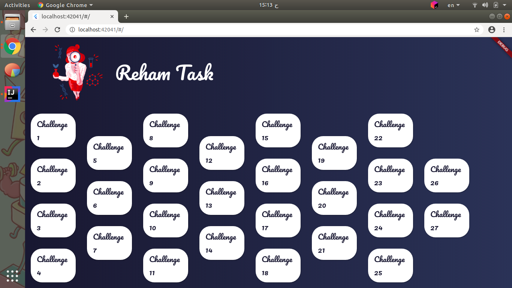
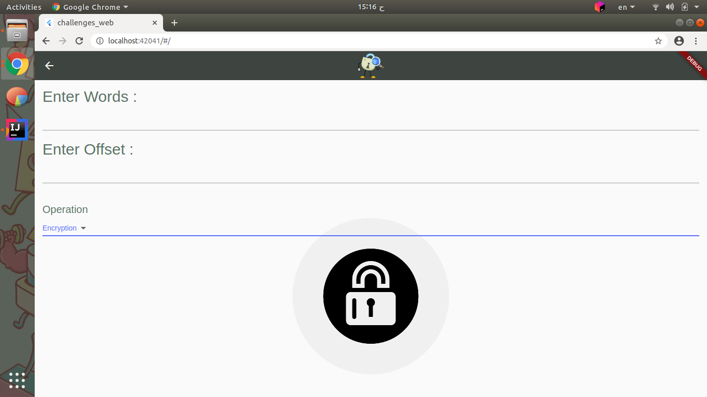

# challenges using flutter mobile / web

implement challanges in Demo/Book of Programming Challenges.pdf using Flutter,

## Installation

get all dependencies

```bash
pub get
```

## Demo








